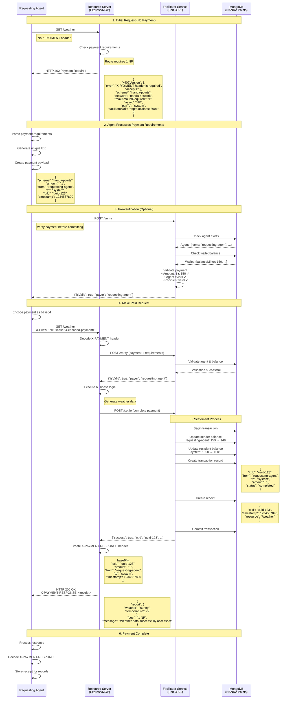

# x402 NANDA Points - Server Infrastructure

**Fork of Coinbase's x402 server examples adapted for NANDA Points settlement instead of blockchain/USDC.**

## Overview

This monorepo forks Coinbase's working x402 server implementations and adapts them to use NANDA Points + MongoDB instead of blockchain settlement. We maintain full x402 protocol compliance while replacing the payment backend.

## What This Enables

- **x402-compliant servers** that return proper HTTP 402 "Payment Required" responses
- **NANDA Points settlement** instead of blockchain transactions
- **Compatibility** with existing x402 clients (x402-axios, x402-mcp, etc.)
- **MCP integration** with Streamable HTTP transport

## Architecture

```
┌─────────────────┐    HTTP 402    ┌─────────────────┐
│  x402 Clients   │ ──────────────► │   Our Servers   │
│ (Coinbase MCP,  │    Payments    │ (This Project)  │
│  x402-axios)    │ ◄────────────── │                 │
└─────────────────┘                └─────────────────┘
                                             │
                                             ▼
                                   ┌─────────────────┐
                                   │ NANDA Points    │
                                   │ Facilitator     │
                                   │ (MongoDB)       │
                                   └─────────────────┘
```

## Quick Start

### Prerequisites
- Node.js 20+
- MongoDB running on port 27017
- NANDA Points database seeded

### 1. Install Dependencies
```bash
npm install
```

### 2. Set up Environment
```bash
cp .env.example .env
# Edit .env with your MongoDB settings
```

### 3. Seed Database
```bash
npm run seed
```

### 4. Start Express Server
```bash
npm run dev:express
```

Your x402-compliant server will be running at:
- **Server**: `http://localhost:3000`
- **Example endpoints**: `/weather` (requires payment), `/health` (free)

### 5. Test with x402 Clients
```bash
# Test with Coinbase's x402-mcp client
# Or use any other x402-compatible client
```

## Packages

### [Express Server](./packages/express-server/)
**Production-ready server with middleware**
- Based on Coinbase's `/examples/typescript/servers/express`
- Uses `paymentMiddleware` for automatic payment handling
- Simple configuration, minimal code changes needed

### [Advanced Server](./packages/advanced-server/)
**Flexible server with manual payment handling**
- Based on Coinbase's `/examples/typescript/servers/advanced`
- Manual payment verification and settlement
- Async settlement patterns, dynamic pricing

### [Facilitator](./packages/facilitator/)
**NANDA Points Facilitator Service**
- Implements x402 facilitator API (`/verify`, `/settle`, `/supported`)
- Handles "nanda-points" payment scheme
- Replaces blockchain calls with MongoDB transactions

### [Shared](./packages/shared/)
**Common utilities and types**
- x402 protocol types and interfaces
- NANDA Points transaction utilities
- Payment validation helpers

## What We Changed from Coinbase x402

### Payment Scheme
- **Before**: EVM blockchain schemes (exact, eip712-usdc-base)
- **After**: "nanda-points" scheme with MongoDB backend

### Settlement
- **Before**: Blockchain RPC calls, smart contract interactions
- **After**: MongoDB transactions, agent balance updates

### Verification
- **Before**: Wallet signature verification, on-chain balance checks
- **After**: Agent authentication, transaction receipt validation

### Facilitator
- **Before**: Ethereum/Solana facilitator endpoints
- **After**: Custom NP facilitator with `/verify`, `/settle`, `/supported`

## Payment Flow Sequence

The following diagram shows the complete x402 payment flow from the Requesting Agent's perspective:



### Key Flow Points:

1. **Initial Request**: Agent requests resource without payment, receives HTTP 402 with payment requirements
2. **Payment Preparation**: Agent creates payment payload with unique transaction ID
3. **Pre-verification**: Optional step to validate payment before committing
4. **Paid Request**: Agent includes X-PAYMENT header with encoded payment
5. **Settlement**: Facilitator atomically updates balances and creates transaction records
6. **Receipt**: Server returns data with X-PAYMENT-RESPONSE header containing settlement proof

### Error Scenarios:

- **Insufficient Balance**: Facilitator returns `{"isValid": false, "invalidReason": "Insufficient balance"}`
- **Invalid Agent**: Facilitator returns `{"isValid": false, "invalidReason": "Agent not found"}`
- **Duplicate Transaction**: Facilitator rejects if txId already exists
- **Settlement Failure**: Server returns HTTP 402 if settlement fails during processing

## Testing

### Unit Tests
```bash
npm test
```

### x402 Protocol Compliance
```bash
npm run test:x402
```

### Integration with Clients
```bash
npm run test:clients
```

## Example Testing Prompts

### Testing Free Resources

The following prompts can be used to test free endpoints that don't require payment:

#### Health Check
```
Can you test the health endpoint of our Express server? It should be available at http://localhost:3000/health and return basic server information without requiring payment.
```

#### Free Weather Data
```
Please test our free weather endpoint at http://localhost:3000/weather. This should return weather information without requiring any NANDA Points payment.
```

### Testing Paid Resources

These prompts test endpoints that require NANDA Points payments:

#### Premium Content (10 NP)
```
Test the premium content endpoint at http://localhost:3000/premium/content. This requires a payment of 10 NANDA Points. You should first try without payment (expect HTTP 402), then make a proper payment using the x402 protocol.
```

#### Premium Analysis (10 NP)
```
Test the premium analysis endpoint at http://localhost:3000/premium/analysis. This costs 10 NANDA Points and should return market analysis data. Please test both the payment failure and success scenarios.
```

### Testing Payment Flow

#### Complete x402 Flow
```
Please test the complete x402 payment flow:
1. Try accessing /premium/content without payment - should get HTTP 402
2. Parse the payment requirements from the response
3. Create a valid NANDA Points payment with txId, amount, from/to agents
4. Retry the request with the X-PAYMENT header
5. Verify the response includes X-PAYMENT-RESPONSE header with settlement details
6. Check that the database balances were updated correctly
```

#### Error Scenarios
```
Test these error scenarios:
1. Insufficient balance - agent with 0 NP trying to pay 10 NP
2. Invalid agent - non-existent agent trying to make payment
3. Duplicate transaction - using the same txId twice
4. Invalid payment format - malformed X-PAYMENT header
```

### Database Verification Prompts

#### Balance Tracking
```
After running payment tests, please check:
1. The sender's balance decreased by the payment amount
2. The recipient's balance increased by the payment amount
3. A transaction record was created in the transactions collection
4. A receipt was generated in the receipts collection
5. All records have matching txId values
```

#### Transaction Logs
```
Please query the MongoDB database and show:
1. Recent transactions from the last 10 minutes
2. Agent wallet balances before and after test payments
3. Receipt details for successful settlements
4. Any failed transaction attempts and their error reasons
```

## Development

### Project Structure
```
packages/
├── express-server/      # Simple middleware-based server
├── advanced-server/     # Manual payment handling server
├── facilitator/         # NP facilitator service
├── shared/              # Common utilities
└── examples/           # Usage examples
```

### Adding a Paid Endpoint (Express Server)
```typescript
// In packages/express-server/index.ts
app.use(
  paymentMiddleware(payTo, {
    "GET /my-endpoint": {
      price: "$0.001",
      network: "nanda-points",
    }
  }, { facilitatorUrl })
);

app.get("/my-endpoint", (req, res) => {
  res.json({ data: "This endpoint requires payment" });
});
```

### Manual Payment Handling (Advanced Server)
```typescript
// In packages/advanced-server/index.ts
app.get("/my-endpoint", async (req, res) => {
  const paymentRequirements = [createNandaPaymentRequirements(
    "10", // 10 NP
    req.originalUrl,
    "My paid endpoint"
  )];

  const isValid = await verifyPayment(req, res, paymentRequirements);
  if (!isValid) return;

  res.json({ data: "Payment verified!" });
});
```

## Contributing

1. Fork the repository
2. Create a feature branch
3. Make changes with full test coverage
4. Ensure zero lint errors: `npm run lint`
5. Submit a pull request

## License

MIT License - see [LICENSE](LICENSE) for details.

## Based on Coinbase x402

This project is based on [Coinbase's x402 protocol](https://github.com/coinbase/x402) server examples. We've adapted the proven implementations to work with NANDA Points while maintaining full x402 protocol compliance.