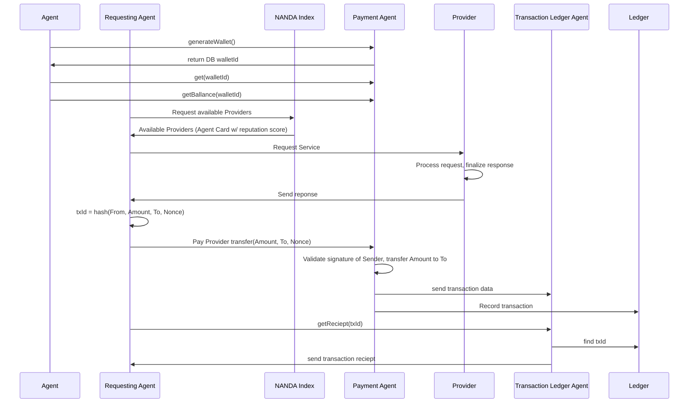

```mermaid
sequenceDiagram
    participant A as Agent
    participant RA as Requesting Agent
    participant I as NANDA Index
    participant PA as Payment Agent
    participant P as Provider
    participant TA as Transaction Ledger Agent
    participant L as Ledger

    A->>PA: generateWallet()
    PA->>A: return DB walletId
    A->>PA: get(walletId)
    A->>PA: getBallance(walletId)
    RA->>I: Request available Providers
    I->>RA: Available Providers (Agent Card w/ reputation score)
    RA->>P: Request Service
    P->>P: Process request, finalize response
    P->>RA: Send reponse
    RA->>RA: txId = hash(From, Amount, To, Nonce)
    RA->>PA: Pay Provider transfer(Amount, To, Nonce)
    PA->>PA: Validate signature of Sender, transfer Amount to To
    PA->>TA: send transaction data
    PA->>L: Record transaction
    RA->>TA: getReciept(txId)
    TA->>L: find txId
    TA->>RA: send transaction reciept
    

```