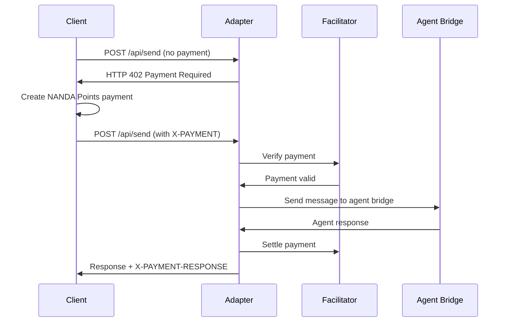

# NANDA Adapter with Payment Integration

A TypeScript adaptation of the [NANDA Adapter](https://github.com/projnanda/adapter) with integrated NANDA Points payment requirements. This implementation demonstrates how to add payment protection to the `/api/send` route using the `@nanda/payments-sdk`.

## Overview

This adapter provides the same functionality as the Python original but adds payment requirements to key endpoints:

- **`/api/send`** - Requires 10 NANDA Points per message
- **`/api/receive_message`** - Requires 5 NANDA Points per received message
- All other endpoints remain free for compatibility

## Features

- 🔗 **Agent Bridge Communication**: Mirrors the Python adapter's A2A messaging
- 💰 **Payment Integration**: Uses `@nanda/payments-sdk` for seamless payment handling
- 🔄 **Real-time Updates**: Server-Sent Events (SSE) for live message streaming
- 📊 **Message Management**: Conversation tracking and message history
- 🏥 **Health Monitoring**: Status endpoints and payment statistics
- ⚡ **x402 Compliant**: Returns proper HTTP 402 responses for payment requirements

## Quick Start

### Prerequisites

- Node.js 20+
- MongoDB running on localhost:27017
- NANDA Points facilitator running on localhost:3001
- Existing NANDA Points agent account

### Installation

```bash
# Clone and navigate to test adapter
cd test-adapter

# Install dependencies
npm install

# Copy environment configuration
cp .env.example .env
# Edit .env with your settings
```

### Configuration

Edit `.env` file:

```bash
# Server Configuration
PORT=8080
HOST=0.0.0.0

# NANDA Points Configuration
FACILITATOR_URL=http://localhost:3001
AGENT_NAME=nanda-adapter

# Agent Bridge Configuration
AGENT_BRIDGE_URL=http://localhost:3000
```

### Start the Server

```bash
npm run dev
```

Your adapter will be running at `http://localhost:8080`

## API Endpoints

### Free Endpoints

| Method | Endpoint | Description |
|--------|----------|-------------|
| `GET` | `/api/health` | Health check and server status |
| `GET` | `/api/agents/list` | List available agents |
| `GET` | `/api/messages/stream` | Server-Sent Events stream |
| `GET` | `/api/render` | Get latest message |
| `GET` | `/api/conversations/:id` | Get conversation history |
| `GET` | `/api/messages` | Get all messages (paginated) |
| `GET` | `/api/stats` | Payment and usage statistics |

### Paid Endpoints 💰

| Method | Endpoint | Cost | Description |
|--------|----------|------|-------------|
| `POST` | `/api/send` | 10 NP | Send message to agent bridge |
| `POST` | `/api/receive_message` | 5 NP | Receive message from agent bridge |

## Usage Examples

### Test Free Endpoints

```bash
# Health check
curl http://localhost:8080/api/health

# List agents
curl http://localhost:8080/api/agents/list

# Get statistics
curl http://localhost:8080/api/stats
```

### Test Paid Endpoints

#### Without Payment (Returns HTTP 402)

```bash
curl -X POST http://localhost:8080/api/send \
  -H "Content-Type: application/json" \
  -d '{
    "message": "Hello, agent!",
    "conversation_id": "test-conv-1",
    "client_id": "test-client"
  }'
```

**Response:**
```json
{
  "x402Version": 1,
  "error": "X-PAYMENT header is required",
  "accepts": [{
    "scheme": "nanda-points",
    "network": "nanda-network",
    "maxAmountRequired": "10",
    "resource": "http://localhost:8080/api/send",
    "description": "Send message to agent bridge",
    "payTo": "nanda-adapter",
    "asset": "NP",
    "extra": {
      "facilitatorUrl": "http://localhost:3001"
    }
  }]
}
```

#### With Payment

```bash
# First create a payment via NANDA Points system, then:
curl -X POST http://localhost:8080/api/send \
  -H "Content-Type: application/json" \
  -H "X-PAYMENT: <base64-encoded-payment>" \
  -d '{
    "message": "Hello, agent!",
    "conversation_id": "test-conv-1",
    "client_id": "test-client"
  }'
```

**Response:**
```json
{
  "success": true,
  "message_id": "msg_1234567890_abc123",
  "conversation_id": "test-conv-1",
  "client_id": "test-client",
  "response": "Agent processed: \"Hello, agent!\" - Response generated for conversation test-conv-1",
  "timestamp": "2024-01-15T10:30:00.000Z",
  "cost": "10 NP",
  "payment_verified": true
}
```

## Server-Sent Events (SSE)

Connect to the message stream for real-time updates:

```javascript
const eventSource = new EventSource('http://localhost:8080/api/messages/stream');

eventSource.onmessage = function(event) {
  const message = JSON.parse(event.data);
  console.log('New message:', message);
};
```

## Payment Flow

1. **Client Request**: Client sends message to `/api/send` without payment
2. **HTTP 402 Response**: Server returns payment requirements
3. **Payment Creation**: Client creates NANDA Points payment
4. **Paid Request**: Client retries with `X-PAYMENT` header
5. **Message Processing**: Server verifies payment and processes message
6. **Agent Response**: Message sent to agent bridge, response returned
7. **Settlement**: Payment settled in background

## Implementation Details

### Key Differences from Python Original

- **TypeScript**: Fully typed implementation with comprehensive error handling
- **Payment Integration**: Native NANDA Points payment requirements
- **Express Framework**: Uses Express.js instead of Flask
- **SDK Integration**: Leverages `@nanda/payments-sdk` for payment handling
- **x402 Compliance**: Follows standard x402 protocol patterns

### Message Flow



### Data Structures

```typescript
interface Message {
  id: string;
  content: string;
  timestamp: string;
  conversationId: string;
  clientId: string;
  response?: string;
}

interface Agent {
  name: string;
  url: string;
  status: 'online' | 'offline';
}
```

## Development

### Build and Run

```bash
# Development mode
npm run dev

# Build for production
npm run build

# Run production build
npm start
```

### Environment Variables

| Variable | Default | Description |
|----------|---------|-------------|
| `PORT` | 8080 | Server port |
| `HOST` | 0.0.0.0 | Server host |
| `FACILITATOR_URL` | http://localhost:3001 | NANDA Points facilitator |
| `AGENT_NAME` | nanda-adapter | Agent name for payments |
| `AGENT_BRIDGE_URL` | http://localhost:3000 | Local agent bridge URL |
| `CLAUDE_API_KEY` | - | Optional Claude API key |

## Testing with x402 Clients

This adapter is compatible with any x402-compliant client:

```bash
# Using x402-axios (example)
npm install x402-axios
```

```typescript
import { X402Client } from 'x402-axios';

const client = new X402Client({
  facilitatorUrl: 'http://localhost:3001',
  agentName: 'my-client'
});

const response = await client.post('http://localhost:8080/api/send', {
  message: 'Hello from x402 client!',
  conversation_id: 'x402-test',
  client_id: 'x402-client'
});

console.log('Agent response:', response.data);
```

## Monitoring and Analytics

### Payment Statistics

The `/api/stats` endpoint provides payment analytics:

```json
{
  "total_messages": 150,
  "paid_messages": 120,
  "free_requests": 30,
  "total_revenue_np": 1200,
  "uptime": 3600,
  "timestamp": "2024-01-15T10:30:00.000Z"
}
```

### Message History

Access conversation history and message logs:

```bash
# Get specific conversation
curl http://localhost:8080/api/conversations/test-conv-1

# Get recent messages
curl http://localhost:8080/api/messages?limit=10&offset=0
```

## Deployment

### Docker Deployment (Optional)

Create `Dockerfile`:

```dockerfile
FROM node:20-alpine
WORKDIR /app
COPY package*.json ./
RUN npm ci --only=production
COPY dist ./dist
EXPOSE 8080
CMD ["npm", "start"]
```

### Production Considerations

- Set up proper SSL certificates
- Configure environment variables securely
- Monitor payment settlement success rates
- Implement proper logging and error tracking
- Set up health checks and monitoring

## Troubleshooting

### Common Issues

1. **Payment verification fails**
   - Check facilitator URL is correct and accessible
   - Verify agent exists in NANDA Points system
   - Ensure sufficient balance in payer account

2. **Agent bridge connection fails**
   - Verify AGENT_BRIDGE_URL is correct
   - Check if agent bridge is running and accessible
   - Review network configuration and firewall settings

3. **TypeScript compilation errors**
   - Ensure you're using Node.js 20+
   - Check that all dependencies are installed
   - Verify tsconfig.json configuration

### Debug Mode

Enable debug logging:

```bash
DEBUG=nanda:* npm run dev
```

## Integration with Original Python Adapter

This TypeScript adapter can work alongside the original Python adapter:

- **Drop-in replacement**: Same API endpoints and response formats
- **Payment enhancement**: Adds payment requirements without breaking existing clients
- **Backward compatibility**: Free endpoints remain unchanged
- **Gradual migration**: Can gradually move endpoints to paid model

## Related Projects

- **Original Adapter**: [https://github.com/projnanda/adapter](https://github.com/projnanda/adapter)
- **NANDA Payments SDK**: [../sdks/payments-sdk/](../sdks/payments-sdk/)
- **x402 Protocol**: [https://github.com/coinbase/x402](https://github.com/coinbase/x402)